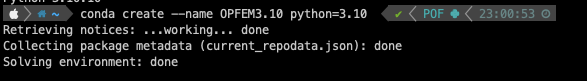
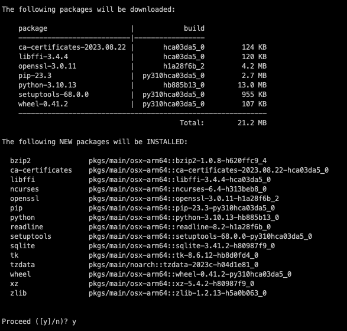
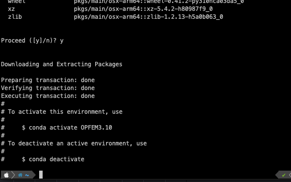
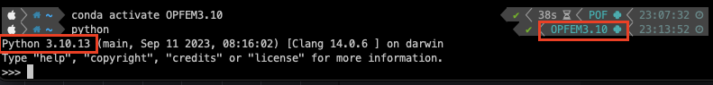
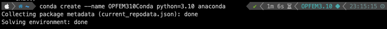

# Installing Python and Creating Environments with Conda in Terminal-An Example

## Creating a Conda Environment with Python 3.10

Begin by opening your terminal and executing the following command:

```
conda create --name OPFEM3.10 python=3.10
```

In this command, "OPFEM3.10" is the name I've chosen for my project's environment. You're free to pick a name that suits your project. Conda will now verify and set up the environment for us.



## Confirmation and Installation

After a brief wait, the terminal will prompt you with a confirmation message. You can proceed with the installation by typing "y" and hitting Enter.



## Installation Complete

Once the installation process is complete, you'll receive information confirming the successful creation of the environment.



## Verifying the Environment

To ensure that the environment was installed correctly, you can verify its existence by running the following command:

```
conda env list
```

This will display a list of all your Conda environments, including the newly created one.

Additionally, activating the 'OPFEM 3.10' environment and inspecting the terminal information is a swift way to verify the installation.



## Using the Conda Metapackage (Optional)

If you want to include commonly used third-party packages like numpy, pandas, and pyqt, you can modify the command slightly. Add "anaconda" at the end of your create environment command:

```
conda create --name OPFEM3.10 python=3.10 anaconda
```

This will install additional packages to your environment for enhanced functionality.



This process illustrates the steps for creating a Conda environment with Python 3.10 and additional packages if desired. It's a powerful approach to isolate your projects and manage dependencies effectively.
