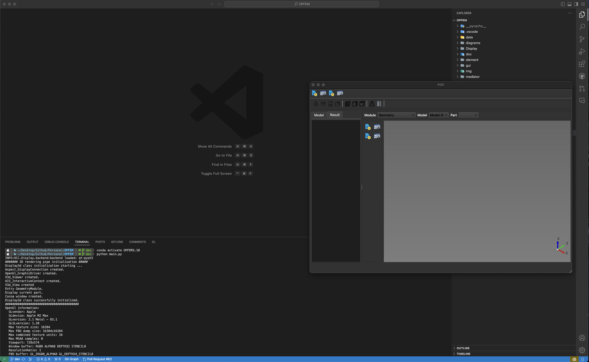

# Quick Start Guide for OPFEM

This Quick Start guide will walk you through the process of setting up and running OPFEM, an open-source Python-based finite element modeling software. Follow these steps to get started:

## Prerequisites

Before you begin, make sure you have the following prerequisites installed on your system:

1. **Python**: Ensure you have Python 3.10 installed. You can download it from [python.org](https://www.python.org/downloads/).

2. **Conda (Optional)**: Consider installing Conda to create virtual environments and manage dependencies. You can download Miniconda or Anaconda from the [official website](https://docs.conda.io/en/latest/miniconda.html).

The installation details and fundamental knowledge about Conda are presented in [Install Anaconda and Python](./install_anaconda_and_python.md). For the current OPFEM environment, it is advisable to install Python 3.10 using Conda with the following steps:

```shell
conda create --name OPFEM3.10 python=3.10
```

## Installing the Required Third-Party Packages

OPFEM relies on several essential third-party packages. To ensure a smooth setup, please follow the provided installation commands in the specified order:

### [pythonocc-core](https://github.com/tpaviot/pythonocc-core)

[PythonOCC-Core](https://github.com/tpaviot/pythonocc-core) is a noteworthy open-source software library that serves as a bridge between Python and the potent Open Cascade Technology (OCCT) framework. OCCT is a leading open-source framework renowned for its prowess in 3D modeling and computer-aided design (CAD) applications. PythonOCC-Core's primary function is to provide Python developers with seamless access to OCCT's extensive capabilities, making it an invaluable asset for projects involving 3D modeling, simulation, and engineering software development.

For those eager to incorporate PythonOCC-Core into their projects, the author of the library recommends utilizing the [conda-forge](https://conda-forge.org/) channel for package installation. This can be easily achieved with the following shell command:

```shell
conda install -c conda-forge pythonocc-core=7.7.2
```

### [PyQt5](https://www.riverbankcomputing.com/software/pyqt/)

[PyQt5](https://www.riverbankcomputing.com/software/pyqt/) is a set of Python bindings for the Qt application framework. [Qt](https://www.qt.io/) is a powerful, cross-platform framework used for developing graphical user interfaces (GUIs), as well as non-GUI applications. PyQt5 allows Python developers to create desktop applications with a native look and feel on various operating systems, such as Windows, macOS, and Linux. You can swiftly install it via Conda from the `conda-forge` channel:

```shell
conda install -c conda-forge pyqt
```

### [PyVista](https://docs.pyvista.org/version/stable/index.html)

[PyVista](https://docs.pyvista.org/version/stable/index.html) is an open-source Python library tailored for the realms of 3D visualization and mesh analysis. As succinctly stated on its official website, PyVista serves as a Pythonic gateway to the Visualization Toolkit (VTK), providing a high-level API for VTK's capabilities. It equips you with a rich toolbox of functions to manipulate 3D data, craft immersive 3D scenes, and carry out diverse analyses on structured and unstructured grids, meshes, and point clouds.

[pyvistaqt](https://qtdocs.pyvista.org/#) is an invaluable extension within the PyVista ecosystem. This optional subpackage seamlessly weaves PyVista's 3D graphical mastery into Qt-based applications. Leveraging Qt's cross-platform capabilities, you can embed PyVista's 3D visualizations into Qt widgets, fostering the creation of interactive 3D applications. Notably, this integration harmonizes with PyQt, the Python binding for Qt, enabling the development of engaging cross-platform 3D applications.

To harness the potential of PyVista and its Qt integration, you can effortlessly install both libraries via conda from the `conda-forge` channel:

```shell
conda install -c conda-forge pyvista
conda install -c conda-forge pyvistaqt
```

## Running the Code

Once you've installed the previously mentioned packages, you're ready to run your code. As an example, if you're using Visual Studio Code (VSCode), follow these steps:

1. **Open Your Project Folder:** Open your project folder in VSCode.

2. **Activate the Python Environment:** In the terminal, activate the installed Python environment by running the following command:

   ```shell
   conda activate OPFEM3.10
   ```

3. **Run Your Code:** With your Python environment active, run your code using the following command:
   ```shell
   python main.py
   ```

Here's a glimpse of the process in action:


Now, your code should execute successfully within the specified Python environment.
